# 🎙️ AI Voice Keyboard & Writer

  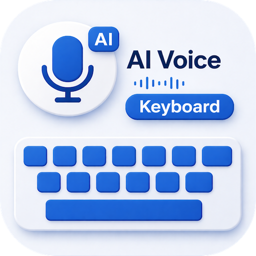

  

  

This is a premium, high-performance Android keyboard application that I architected and developed **completely from scratch** during my time at **Zeesoft Tech**. 

Rather than building a standard keyboard, I engineered this product to put the power of advanced Large Language Models (LLMs) directly into the user's typing interface. It operates as a fully integrated **AI Writing Assistant and Multilingual Translator** that works seamlessly inside any text box across Android—including WhatsApp, Gmail, LinkedIn, Instagram, and more. 

With **over 1,000+ active downloads** on the Google Play Store, the application represents a powerful leap forward in mobile productivity and smart writing.

## 👨‍💻 My Role & Technical Contributions

As the **Lead Android Developer**, I solely architected and developed the entire application from the ground up. My key technical contributions included:

* **🏗️ Custom IME Keyboard Architecture:** Programmed and optimized the core Android Input Method Editor (IME) service from scratch, ensuring extremely low latency, smooth key buffering, and fast keyboard layout switching.
* **🧠 LLM & AI Writing Pipeline:** Developed the client-side integration of Large Language Models (LLM) to perform real-time, context-aware text processing (such as on-the-fly grammar scanning, summarization, and tone shifting) directly inside the typing thread.
* **🌐 Multilingual Translation Engine:** Built the real-time keyboard translation module, supporting direct text conversion into **100+ global languages** instantly before sending.
* **🎨 Material 3 Theme Engine:** Designed and implemented a modern visual interface following Google's **Material 3 / Material You** specifications, featuring dynamic theme customization options, fluid transition animations, and custom keyboard styles.

## 🔒 Code Sharing & Intellectual Property Notice

Because this app is actively published and holds proprietary commercial value, **the source code cannot be shared publicly** under my employment and confidentiality agreements with **Zeesoft Tech**. 

I have created this repository to showcase:
* The UI/UX styling and design direction.
* The feature set and user experience workflows.
* The architectural design and product scope of what I built.

## 🚀 The AI Features I Developed

### ✍️ Professional AI Writing & Editing Suite
I built a complete, high-performance writing toolkit that executes deep text analysis natively as the user types:
* **AI Grammar & Spell Checker:** Programmed a deep-scan grammar engine that corrects complex syntax errors, punctuation, and typos in real-time.
* **Smart Paraphrasing Tool:** Developed an AI rewriter allowing users to instantly restructure sentences to be more professional, friendly, or concise.
* **Text Lengthener (Continue Writing):** Created a smart context-continuation feature that analyzes typed text and generates the next few sentences to eliminate writer's block.
* **AI Text Summarizer:** Added a keyboard utility that condenses long paragraphs or articles into concise bullet points.
* **Synonym Finder & AI Dictionary:** Integrated a search tool providing contextual definitions and synonyms to enhance vocabulary impact.

### 🌐 Translation & Voice Dictation Hub
I engineered a highly reliable communication center to break down language barriers:
* **Real-Time Keyboard Translator:** Automatically translates typed text on the fly into **100+ languages** (including Spanish, French, Arabic, Hindi, and Chinese) directly inside any input field.
* **AI Voice-to-Text Dictation:** Built a high-precision voice typing engine that accurately understands varying regional accents and continuous natural speech on the go.

### 🎨 Creative Keyboard Personalization
I integrated fun, creative features to make mobile communication stand out:
* **Tone Adjuster:** Added a quick tone-switching utility that morphs the attitude of typed text (e.g., from "Urgent" to "Polite") in one tap.
* **Smart Emojifier:** Developed an emotion-analyzer that matches the emotional tone of written text and suggests the perfect emojis.
* **Versify (Text-to-Poetry):** Built a creative module that automatically turns plain sentences into beautiful rhyming poems or verses.

## 🌍 Supported Languages

The app supports 40+ major global languages and regional dialects:
* **English** (US, UK, India, AU)
* **Hindi** (हिंदी वॉयस टाइपिंग)
* **Arabic** (لوحة مفاتيح الكتابة بالصوت)
* **Spanish** (Escritura por voz)
* **French** (Saisie vocale)
* **Portuguese** (Digitação por voz)
* **German** (Sprache zu Text)
* **Japanese** (音声入力キーボード)
* **Urdu** (اردو وائس ٹائپنگ)
* **Bengali** (বাংলা ভয়েস টাইピング)
* ...and many more!

## 📱 App Screenshots

Here is a look at the final user interface, custom keyboard styles, and AI writing modules that I built:

  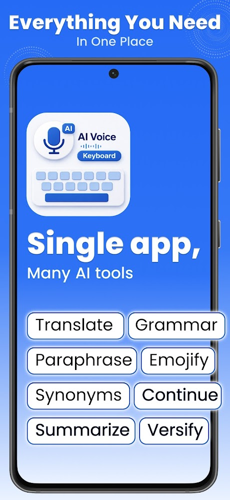
  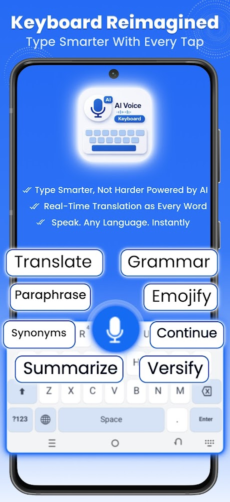
  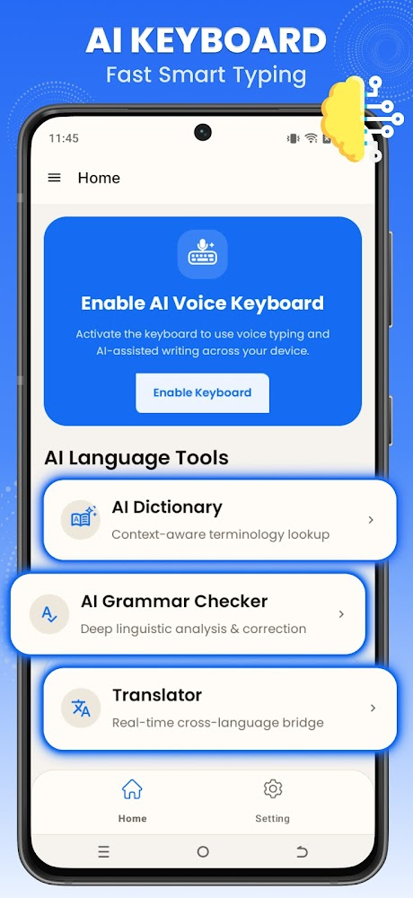

  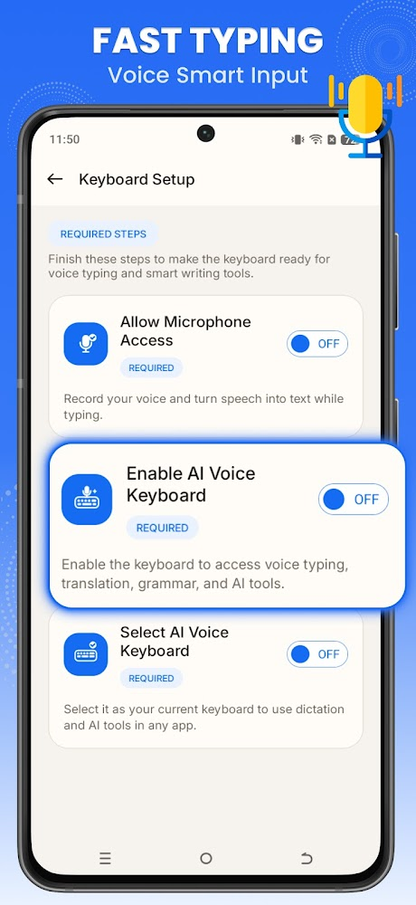
  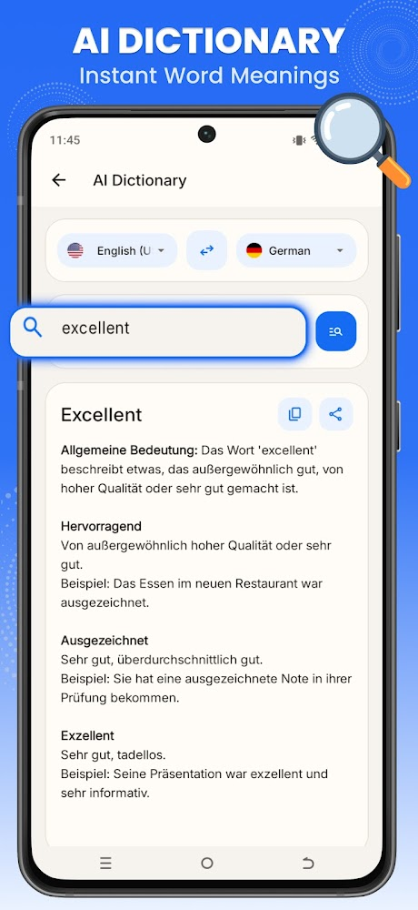
  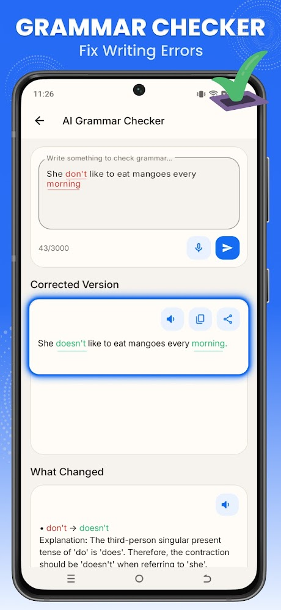

  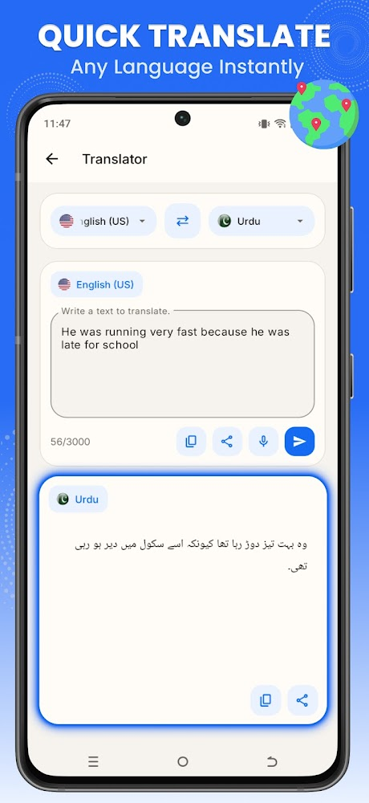
  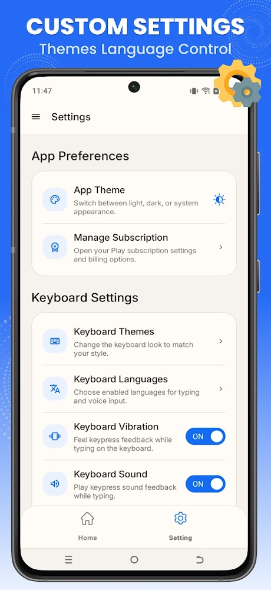
  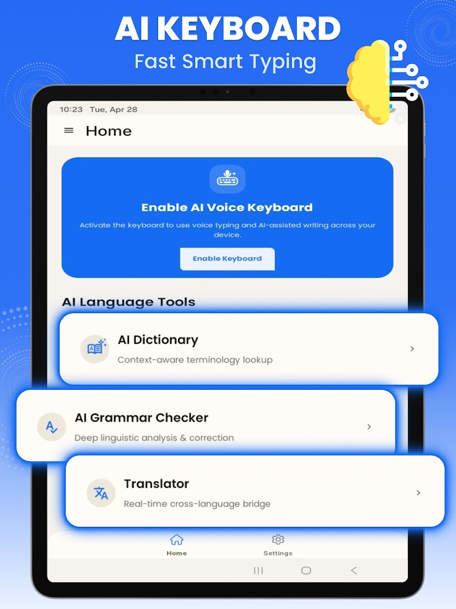

  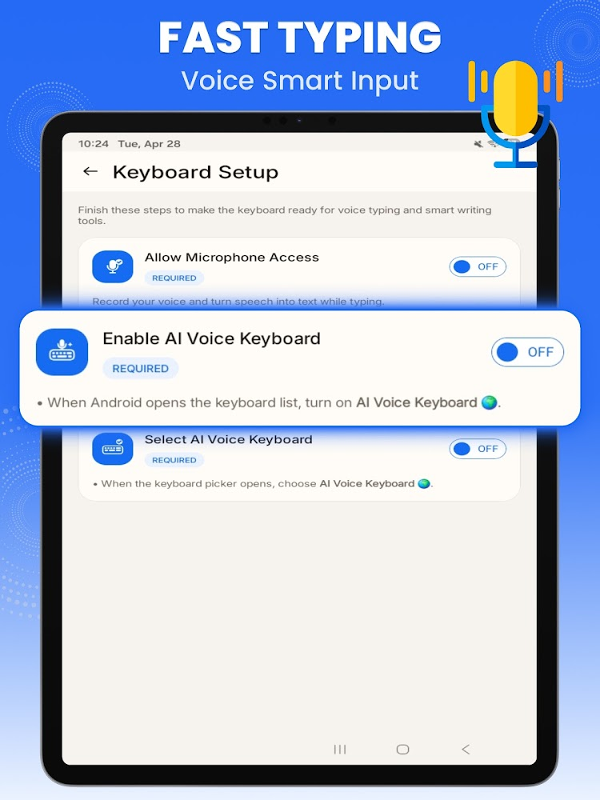

## 🏢 Project Details
* **Role:** Lead Developer (Ground-up Architecture & Full-Stack Development)
* **Company:** Zeesoft Tech
* **Availability:** Available on the Google Play Store (**1K+ Downloads**), [**Download Now**](https://play.google.com/store/apps/details?id=com.aivoice.keyboard.voicetyping&hl=en)
